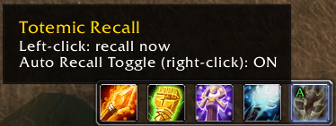
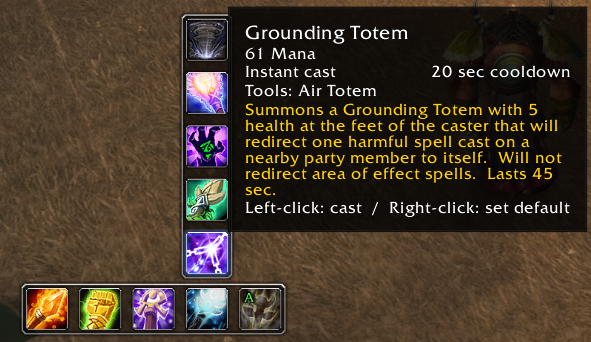
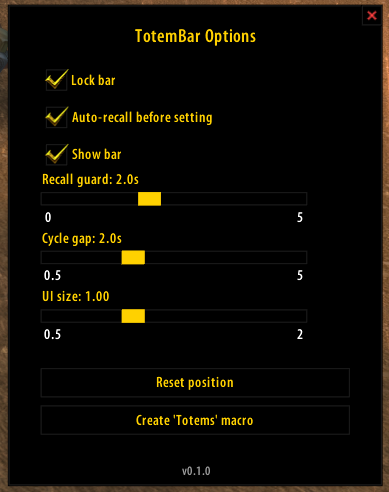

# TotemBar

A lightweight shaman totem bar for **TurtleWoW / WoW 1.12.1 (Vanilla)**.

Pick one totem per element, cast it with a click, cycle through your other
known totems from a hover flyout, or drop all four at once from a single
macro press. No dependencies required — TotemBar looks and works fine on
its own, and automatically adopts the [pfUI](https://github.com/shagu/pfUI)
look (fonts, skinned buttons/sliders) when pfUI is installed.

## Screenshots







## Features

- **Four element buttons + Totemic Recall.** One button per element
  (Fire / Earth / Water / Air), plus a dedicated Totemic Recall button.
  - Left-click an element button: cast its chosen totem.
  - Right-click an element button: clear the slot.
- **Hover flyout.** Hovering an element button pops up the other totems you
  know for that element.
  - Left-click a flyout totem: cast it once, without changing the slot's default.
  - Right-click a flyout totem: make it the slot's new default.
- **One-press "Totems" macro.** A macro entry point casts all four chosen
  totems from a single keypress. It carries a double-press guard (2s by
  default) so a rapid second press won't re-trigger Totemic Recall and wipe
  the totems you just dropped. The options panel can create/update this
  macro for you — just drag it onto your action bar afterwards.
- **Visual feedback.** Native action-button-style radial cooldown swipes on
  every button, plus an OmniCC-style remaining-duration timer underneath.
  Totems tint red when you've wandered out of range (detected via buff
  presence), and the Recall button pulses whenever any totem is currently
  out of range. Tooltips show the real in-game spell tooltip plus click hints.
- **Minimap button.** Drag it around the minimap to reposition (saved).
  Left-click opens the options panel, right-click toggles the bar. Built to
  survive pfUI's minimap button collection; `/tb options` always works as a
  fallback.
- **Options panel.** Lock the bar, toggle auto-recall, show/hide the bar,
  tune the recall guard and cycle-reset-gap timers, scale the whole UI,
  reset the bar's position, and create the "Totems" macro — all from one
  panel. Settings are saved per character.
- **Assignment seam (advanced/optional).** `TotemBar.ReceiveAssignment(set, label)`
  lets an external addon suggest a totem set; TotemBar shows it as a
  one-click "apply" panel (never auto-casts). This is a hook for a future
  raid totem-assignment addon — most users can ignore it entirely.

## Install

1. Copy the `TotemBar` folder into your `Interface\AddOns\` directory.
2. Restart the client (or `/reload` if you're just updating files that
   already exist on disk — see [Notes](#notes) below).

No dependencies required.

## Usage

| Action | Effect |
| --- | --- |
| Left-click element button | Cast that element's chosen totem |
| Right-click element button | Clear that element's slot |
| Hover element button | Show a flyout of the element's other known totems |
| Left-click flyout totem | Cast it once (doesn't change the default) |
| Right-click flyout totem | Set it as the slot's new default |
| Left-click Recall button | Cast Totemic Recall |
| Right-click Recall button | Toggle auto-recall (recall-before-redeploy) |
| Left-click minimap button | Open options |
| Right-click minimap button | Toggle the bar |
| Drag minimap button | Reposition it around the minimap |

### Slash commands

```
/tb            Toggle the bar
/tb options    Open the options panel
/tb lock       Lock/unlock dragging the bar
/tb scan       Print your known totem spells (dev aid)
/tb assign     Inject a test assignment set (dev aid)
```

### The "Totems" macro

Open the options panel and click **Create 'Totems' macro**. This creates
(or updates) a general macro named `Totems` that casts all four of your
chosen totems in one press:

```
/script TotemBar.recallAndCastAll()
```

Drag it onto your action bar. With auto-recall on (the default), it
recalls your existing totems first and then redeploys all four; the guard
timer prevents a fast accidental second press from recalling the totems
you just placed.

## Options

Open with the minimap button's left-click or `/tb options`.

- **Lock bar** — disable dragging.
- **Auto-recall before setting** — whether the "Totems" macro casts
  Totemic Recall before redeploying.
- **Show bar** — show/hide the bar.
- **Recall guard (sec)** — minimum time between an auto-recall and the
  next one, to protect a just-placed set from a rapid double press.
- **Cycle reset gap (sec)** — how long before a totem-cycling macro press
  restarts from the first totem instead of advancing.
- **UI size** — scales the whole bar (and its flyout) from its top-left
  corner.
- **Reset position** — re-centers the bar on screen.
- **Create 'Totems' macro** — creates or updates the macro described above.

## Requirements

- TurtleWoW client (WoW 1.12.1).
- [pfUI](https://github.com/shagu/pfUI) — optional. When present, the
  options panel adopts pfUI's look; TotemBar works standalone otherwise.

## For developers

Pure-logic modules under `core/` (cast-cycle math, config defaults, buff
matching, assignment validation, etc.) are unit-tested offline against a
real Lua 5.0.3 interpreter — see `tools/luatests/`. WoW-API-facing files
(`ui.lua`, `options.lua`, `minimap.lua`) are syntax-checked only, since
they depend on the live client.

## Notes

- `/reload` is enough for changes to existing `.lua`/`.xml` files.
- A full client restart is needed if `.toc` entries change or files are
  added/removed/renamed.

## License

MIT (see LICENSE).
