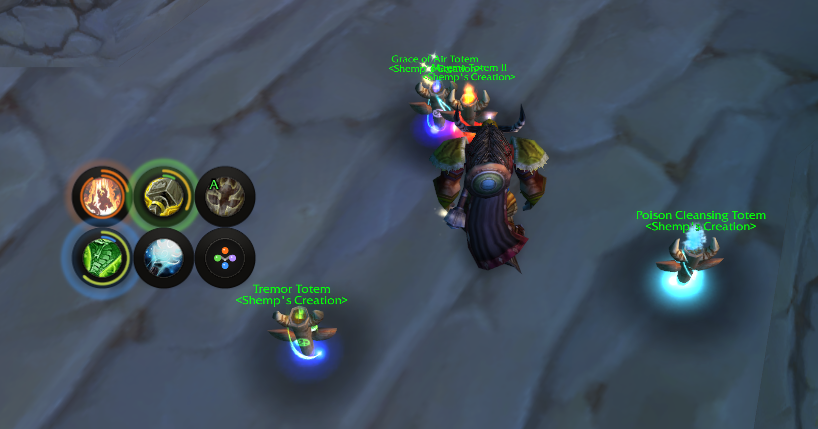
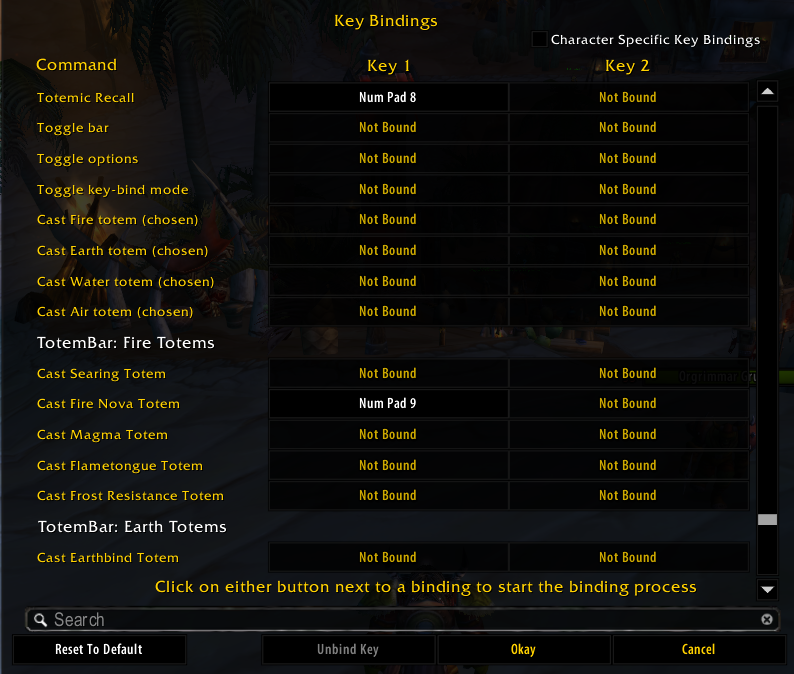
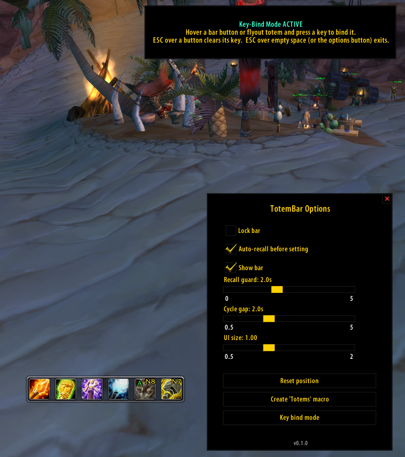

# TotemBar

A lightweight shaman totem bar for **TurtleWoW / WoW 1.12.1 (Vanilla)**.

Pick one totem per element, cast it with a click, cycle alternatives from a
hover flyout, or drop all four with a single press. Every slot shows **how
long the totem still stands** (outer ring, green → red) and **when it pulses
next** (inner ring in the element's color) — with timings taken from actual
server data, not guesswork. No dependencies; adopts the
[pfUI](https://github.com/shagu/pfUI) look automatically when present.



## What's new — v0.2.0 · *The Pulse UI release* · 2026-07-10

- **Round floating slots** — the square boxes are gone; icons float in a
  subtle shadow-rim frame, with round hover/pressed states everywhere.
- **Time traffic light** — the outer ring drains with the totem's remaining
  lifetime and shifts green → yellow → orange → red.
- **Pulse ring** — a thin element-colored inner arc fills toward the next
  pulse and resets when it fires, animated per frame.
- **Server-accurate pulse timing** — intervals and first-tick behavior from
  TurtleWoW server data (Tremor pulses every **4s** and immediately on
  placement; Magma and the water totems first pulse one interval in). Water
  totems re-anchor on the real observed mana/heal ticks.
- **Pulse waves & glow** — a ripple in the element color marks each pulse; a
  halo builds just before it.
- **Bar layouts** — 1×6, 2×3 (elements as a 2×2 block) or 3×2.
- **Custom art set** — element glyphs for empty slots, drop-set icon, minimap
  glyph, skinned options panel. All generated by scripts in `tools/`.

**Version history** — details in [CHANGELOG.md](CHANGELOG.md):

- **v0.2.3** (2026-07-13) — fixes a bug where dropping your set could make the
  new totems vanish an instant later: with nampower, Totemic Recall was queued
  behind the global cooldown and fired *after* the (off-GCD) totems were
  placed, sweeping them. Recall now bypasses the spell queue so it can't pull a
  fresh set.
- **v0.2.2** (2026-07-10) — "Button spacing" slider in the options panel;
  keybind casts now feed TotemBar's own duration/pulse timers (previously
  only click-casts and pfUI did); removed the dead `pulseGlow` setting.
- **v0.2.1** (2026-07-10) — tooltips now show your highest known rank (they
  read rank-1 values before; the cast itself was always highest-rank) and
  display the rank next to the name.
- **v0.1.3** (2026-07-09) — Totemic Recall no longer wastes its 6s cooldown
  when no totems are out.
- **v0.1.2** (2026-07-09) — mana cost on the drop-set tooltip, live refund
  estimate on the Recall tooltip, Totemic Mastery duration bonus, rank-aware
  mana scan.
- **v0.1.1** (2026-07-09) — key bindings (Esc menu section for every action
  and every single totem), drop-set bar button, hover-bind mode with
  per-button key labels.
- **v0.1.0** (2026-07-09) — first public release: element buttons, hover
  flyout, "Totems" macro with recall guard, minimap button, options panel,
  duration timers, out-of-range tint.

## Screenshots

| The bar & flyout | Options panel |
| :---: | :---: |
| <br> |  |

| Key bindings | Hover-bind mode |
| :---: | :---: |
|  |  |

*(Click any image for full size.)*

## Features

**Casting**
- One button per element (Fire / Earth / Water / Air): left-click casts the
  chosen totem, right-click clears the slot.
- Hover flyout with your other known totems per element — left-click casts
  once, right-click makes it the new default.
- **Drop-set button** and a one-press **"Totems" macro** cast all four chosen
  totems at once, guarded against accidental double presses (so a fast second
  press won't recall the set you just placed).
- Dedicated **Totemic Recall** button that only fires when totems are
  actually out — never wastes Recall's 6s cooldown. Right-click toggles
  auto-recall-before-redeploy.

**At-a-glance timing**
- **Duration ring:** the outer ring drains with the totem's lifetime,
  colored green → yellow → orange → red by remaining time.
- **Pulse ring:** the inner arc (element color) fills toward the next pulse —
  intervals and first-tick behavior derived from TurtleWoW server data, water
  totems locked onto their real observed ticks.
- **Pulse waves:** an expanding ripple marks each pulse, a soft halo
  announces it just before, and a spawn ripple confirms each placement.
- Optional countdown text under each slot; totems tint red when you leave
  their range (buff-presence based), and the Recall button pulses while
  anything is out of range.
- Native cooldown swipes and real in-game spell tooltips everywhere.

**Control**
- **Key bindings:** an Esc → Key Bindings section for every action — including
  a binding for every single totem you know — plus a fast **hover-bind mode**
  (hover a button, press a key). Bound keys show on the buttons.
- **Layouts:** one row (1×6), two rows (2×3, elements grouped 2×2) or three
  rows (3×2), switchable live.
- **Minimap button** (drag to reposition, left-click options, right-click
  toggles the bar) and a skinned **options panel** for everything else.
- **Assignment seam** for future raid tools: an external addon can *suggest*
  a totem set via `TotemBar.ReceiveAssignment` — shown as a one-click apply
  panel, never auto-cast. See [`docs/API.md`](docs/API.md).

## Install

**Option A — download (simplest):**

1. Grab **`TotemBar-vX.Y.Z.zip`** from
   [**Releases**](https://github.com/ShempError/TotemBar/releases).
   *(Use the Release zip, not "Code → Download ZIP" — that names the folder
   `TotemBar-master`, which WoW won't load.)*
2. Extract the **`TotemBar`** folder into `Interface\AddOns\`.
3. Restart the client.

**Option B — git (auto-updatable):**

```
cd Interface/AddOns
git clone https://github.com/ShempError/TotemBar.git TotemBar
```

`master` is the stable release channel — git-based managers
(GitAddonsManager, OctoWoW) stay current with a `git pull`. `dev` is
work-in-progress.

## Usage

| Action | Effect |
| --- | --- |
| Left-click element button | Cast that element's chosen totem |
| Right-click element button | Clear that element's slot |
| Hover element button | Flyout with the element's other known totems |
| Left-click flyout totem | Cast it once (default unchanged) |
| Right-click flyout totem | Set it as the slot's new default |
| Left-click Recall | Cast Totemic Recall (only when totems are out) |
| Right-click Recall | Toggle auto-recall |
| Left-click drop-set button | Cast all four chosen totems |
| Minimap button | Left: options · Right: toggle bar · Drag: reposition |

**Slash commands:** `/tb` (toggle bar) · `/tb options` · `/tb lock` ·
`/tb bind` (hover-bind mode) · `/tb scan`, `/tb assign`, `/tb manadump`,
`/tb pulsecal` (dev aids).

**The "Totems" macro:** options panel → **Create 'Totems' macro**, then drag
the `Totems` macro to your action bar. One press recalls (if auto-recall is
on) and redeploys all four chosen totems.

## Options

Open with the minimap button or `/tb options`.

| Option | Does |
| --- | --- |
| Lock bar | Disable dragging |
| Auto-recall before setting | Recall first when the macro/drop-set fires |
| Show bar | Show/hide the whole bar |
| Show duration ring | Outer remaining-time ring (traffic-light colors) |
| Show pulse ring | Inner next-pulse arc (element color) |
| Show pulse waves | Ripple + glow effects on pulses |
| Show countdown text | Remaining-seconds text under each slot |
| Layout | Cycle 1×6 / 2×3 / 3×2 |
| Recall guard (sec) | Double-press protection window |
| Cycle reset gap (sec) | When macro cycling restarts at totem 1 |
| UI size | Scales bar + flyout from the top-left corner |
| Reset position / Create macro / Key bind mode | One-click actions |

## Requirements

- A WoW 1.12.1 client (TurtleWoW). **No addon dependencies.**

Optional, auto-detected: **pfUI** (skinned widgets; its `libtotem` feeds the
timers as an extra source) and **SuperWoW** (only used by the `/tb scan` /
`/tb pulsecal` dev aids for file exports).

## For developers

- Public API for companion addons: [`docs/API.md`](docs/API.md).
- Pure-logic modules under `core/` are unit-tested offline against a real
  Lua 5.0.3 interpreter (`tools/luatests/`, 14 suites). WoW-API files are
  syntax-checked; in-game behavior is verified on TurtleWoW.
- All textures are **generated**: `tools/gen_*.js` (zero-dependency Node)
  render the ring/FX/icon/panel sheets as 1.12-safe TGAs, and
  `tools/preview_*.js` composite them into PNG previews for review without
  launching the client.
- `/reload` covers changes to existing `.lua` files; a client restart is
  needed for `.toc` changes, new files, or changed textures (the client
  caches them).

## License

MIT (see LICENSE).
